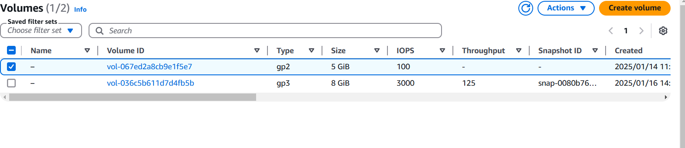
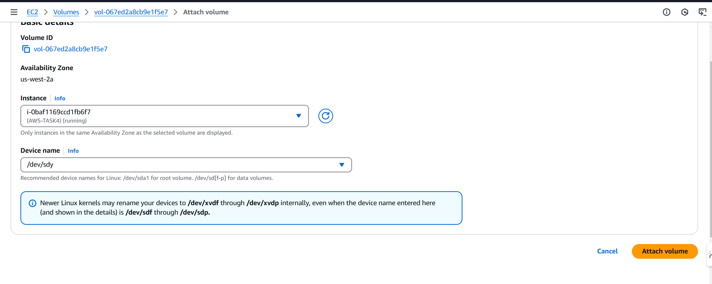
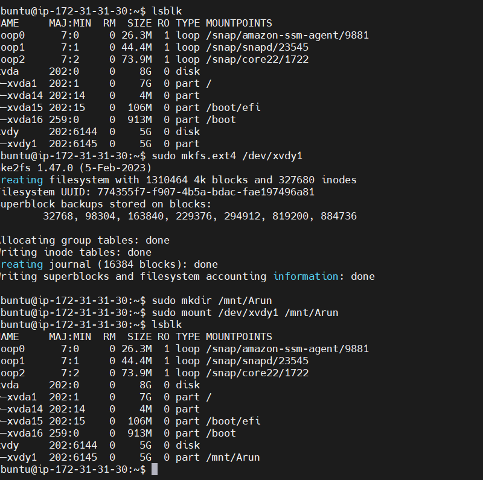
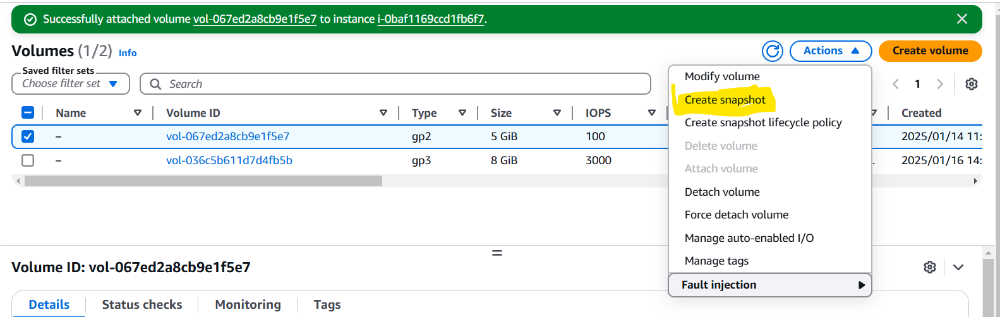
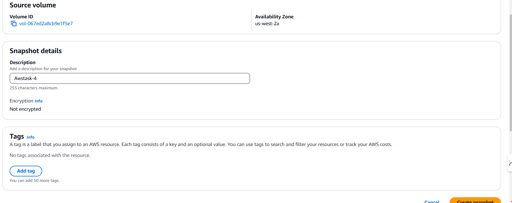
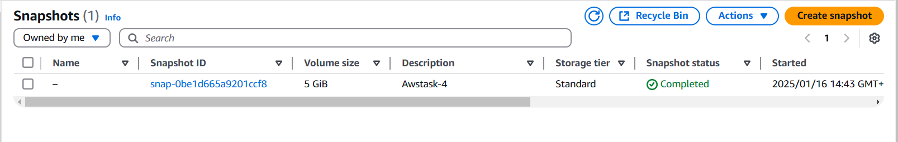
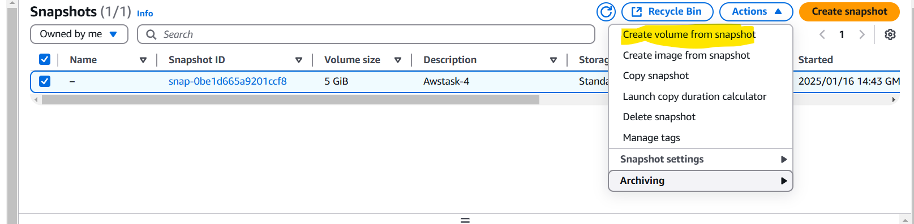
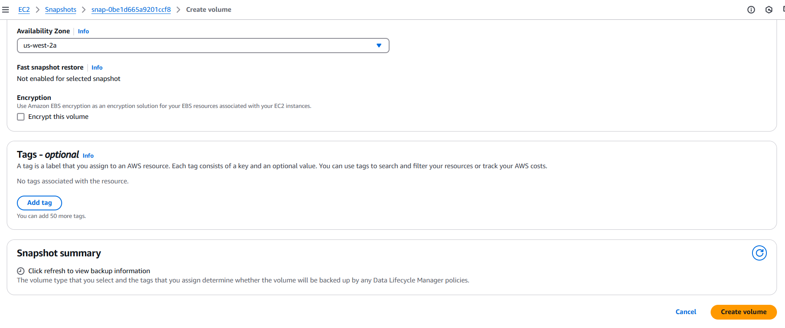
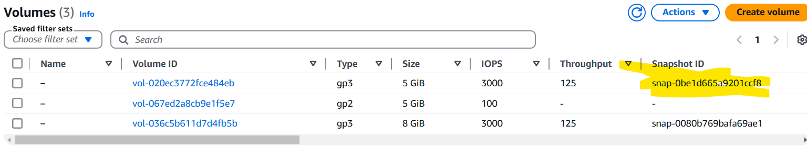

Task : Launch an EC2 instance (Linux and Windows) along with a web server. Then, create an EBS volume of 5 GB, attach it to an EC2 machine (Linux and Windows), and take a snapshot. Finally, create an EBS volume using the taken snapshot.

screenprints :

lunch the ec2 instances

CREATE A VOLUME WITH 5GB 

attach the volume to ec2 

Create a snapshot of it 

create a ebs volume using taken snapshot 

